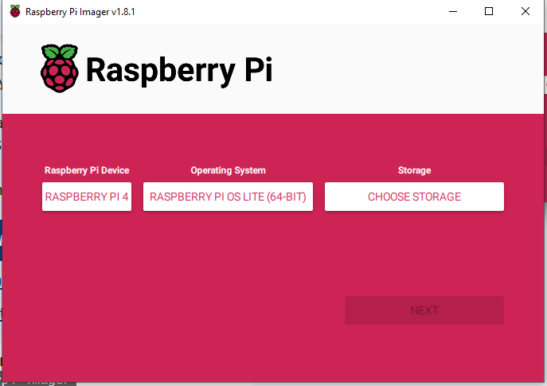

# Raspberry Pi Camera Preview Setup

This script initializes a camera preview on boot for a Raspberry Pi 4B with a connected camera module. It is designed to work with a clean Raspberry Pi OS Lite installation on an SD card. Follow the steps below to configure the camera preview:

1. **Prepare Your Raspberry Pi:**
    - Install the [Raspberry Pi Imager](https://www.raspberrypi.com/software/)
   - In the imager, begin with a clean Raspberry Pi OS Lite 64-bit installation to an SD card. 
   
   - Plug in your camera module and SD card to the Pi, then boot up the Pi.
   - When prompted, setup the keyboard configuration to US-EN and set ``pi`` as the default username

2. **Install Git:**
    - Since Raspberry Pi OS Lite does **NOT** include Git by default, install it manually:

      ```bash
      sudo apt install git
      ```

2. **Clone the Git Repository:**
   - Open a terminal on your Raspberry Pi.
   - Clone this git repository using the following command:

     ```bash
     git clone https://github.com/bryantb2/Pi-Camera-Preview.git
     ```

3. **Run the Setup Script:**
   - Navigate to the cloned repository:

     ```bash
     cd Pi-Camera-Preview
     ```

   - Make the setup script executable:

     ```bash
      chmod +x setup.sh
     ```

   - Execute the setup script:

     ```bash
     ./setup.sh
     ```

   The script will install the necessary packages, configure the camera startup behavior, and set the Pi into "kiosk mode," preventing users from tampering with the configuration. Once the setup completes, the device will reboot and the live camera feed will appear!

Note: Ensure that you have a basic understanding of the Raspberry Pi and its setup before proceeding with these steps.